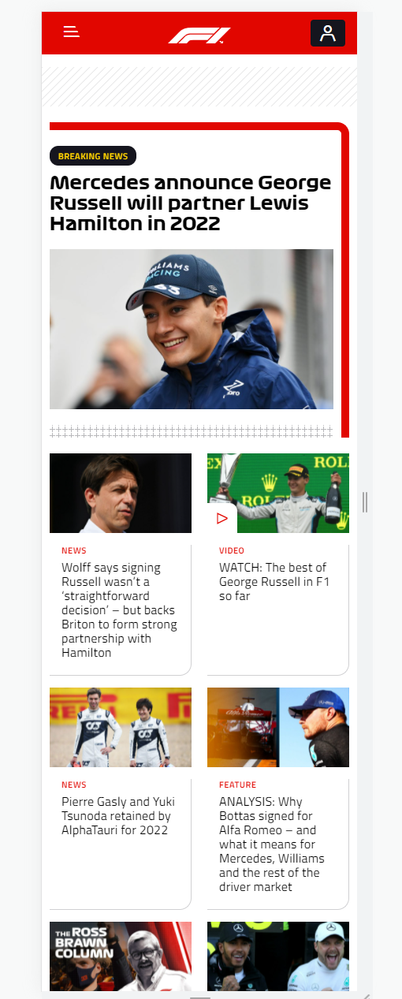
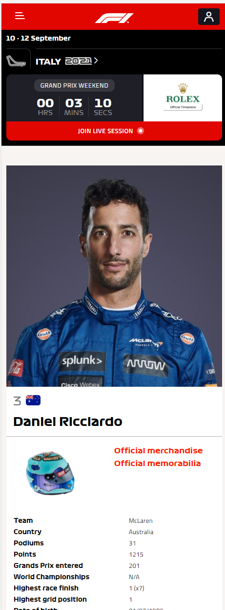
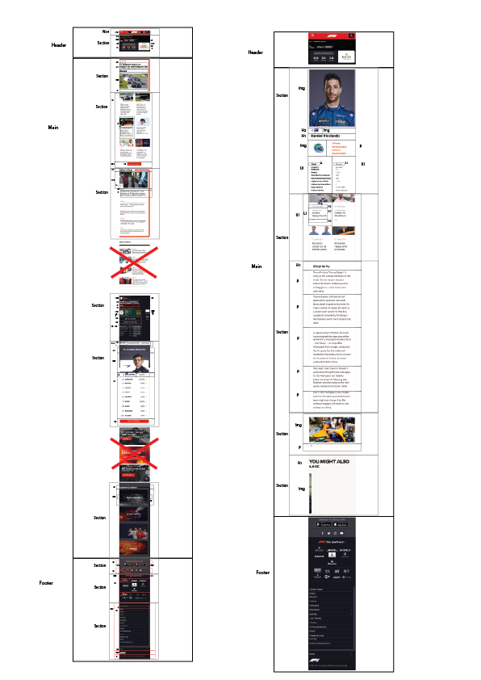

# Procesverslag
Markdown is een simpele manier om HTML te schrijven.  
Markdown cheat cheet: [Hulp bij het schrijven van Markdown](https://github.com/adam-p/markdown-here/wiki/Markdown-Cheatsheet).

Nb. De standaardstructuur en de spartaanse opmaak van de README.md zijn helemaal prima. Het gaat om de inhoud van je procesverslag. Besteedt de tijd voor pracht en praal aan je website.

Nb. Door *open* toe te voegen aan een *details* element kun je deze standaard open zetten. Fijn om dat steeds voor de relevante stuk(ken) te doen.

## Jij

uitwerken voor kick-off werkgroep

### Auteur:
Megan de Ruig

#### Je startniveau:
Blauw (Heb zeker interesse in het schrijven van code en vind het ook leuk om te doen, maar ik ben nog steeds een beginner en heb soms nog wel eens hulp nodig.)

#### Je focus:
Responsive
 

## Je website

uitwerken voor kick-off werkgroep

### Je opdracht:
De website die ik ga namaken is de F1 Website: https://www.formula1.com/

#### Screenshot(s) van de eerste pagina (small screen): 
De Home page:  

#### Screenshot(s) van de tweede pagina (small screen):
Daniel Ricciardo Page:

 

## Breakdownschets (week 1)

uitwerken na afloop 2e werkgroep

### de hele pagina: 

### dynamisch deel (bijv menu): 

### wellicht nog een dynamisch deel (bijv filter): 

## Voortgang 1 (week 2)

uitwerken voor 1e voortgang

### Stand van zaken
Voor voortgangsgesprek 1 waren beide html pagina's af en was
er een begin van de header styling van de "daniel" page.

### Agenda voor meeting
samen met je groepje opstellen

| student 1      | student 2          | student 3    | student 4        |
| ---            | ---                | ---          | ---              |
| dit bespreken  | en dit             | en ik dit    | en dan ik dat    |
| en dat ook nog | dit als er tijd is | nog een punt | dit wil ik zeker |
| ...            | ...                | ...          | ...              |

### Verslag van meeting
hier na afloop snel de uitkomsten van de meeting vastleggen

- De "h's" moesten in de html opnieuw georderd worden aangezien ik meerdere h1's had gebruikt en dit uiteraard niet
de bedoeling was. Als gevolg hiervan moesten eigenlijk alle h tags aangepast worden.
- De nav moest in een ul gezet worden omdat dit er netter uitzag.
- Verder was de html goed op orde en zaten er geen classes/divs in wat erg goed was.
- Wat betreft de css waren de selectoren goed op orde en kreeg ik nog enkele tips
over hoe ik de header in elkaar zou kunnen zetten.

## Voortgang 2 (week 3)

uitwerken voor 2e voortgang

### Stand van zaken
De css voor de "daniel" page was volledig afgemaakt en compleet zodat er feedback
op gegeven kon worden. De css werkte echter wel alleen nog maar voor de Galaxy S5 (een mobile version)
waardoor het er op bijv. desktop nog niet goed uitzag. Kortom de responsive kant was nog niet af. 

### Agenda voor meeting
samen met je groepje opstellen

| student 1      | student 2          | student 3    | student 4        |
| ---            | ---                | ---          | ---              |
| dit bespreken  | en dit             | en ik dit    | en dan ik dat    |
| en dat ook nog | dit als er tijd is | nog een punt | dit wil ik zeker |
| ...            | ...                | ...          | ...              |

### Verslag van meeting
hier na afloop snel de uitkomsten van de meeting vastleggen

- CSS OPSCHONEN: In de css was enorm veel gebruik gemaakt van position absolute/relative, dit moet
veranderd worden omdat het er responsive niet goed uitziet en er allerlei items
willekeurig op de pagina zweven.
- Er moet gebruik worden gemaakt van Flexbox voor de header zodat deze ook responsive er goed uitziet.

## Toegankelijkheidstest (week 4)

uitwerken na test in 8e voortgang

### Bevindingen
Lijst met je bevindingen die in de test naar voren kwamen:

#### Tab Toets

Met de tab toets is grotendeels van mijn site niet bereikbaar doordat ik van bijv.
de nieuws items geen links ect. heb gemaakt en er dus alleen maar genavigeerd kan worden
over een aantal buttons die op de site staan. 

#### Grijze tekst nog net zichtbaar

Op de site staan verschillende zinnen in het grijs weergegeven. Tijdens de test met de brillen
heb ik gemerkt dat deze tekst moeilijker leesbaar is in vergelijking met de zwarte tekst op een
witte achtergrond. Inprincipe is de tekst dus nog wel leesbaar maar is het wel lastiger te zien.

## Voortgang 3 (week 4)

uitwerken voor 3e voortgang

### Stand van zaken
Na het compleet opschonen van de css ( 3/4 van de code voor pagina 2 overnieuw schrijven)
was de hele "Daniel" page responsive en af. Verder zijn de eerste nieuws items van de home page
ook af voor de mobile version. Over het algemeen ging het opnieuw schrijven van de css
erg goed nadat ik eenmaal doorhad hoe ik flexbox/grid kon toepassen ipv position absolute en relative.

Echter liep ik bij de header met een timer erin voor de volgende gp vast. De header zag er op
mobile goed  uit echter was hij responsive nog niet volledig werkende. Daarom wilde ik op de F1
site kijken hoe zij deze header gemaakt hadden maar helaas was kwam ik erachter dat de header weg
was gehaald omdat er een periode van 2 weken tussen de Grand Prix's zat. Kortom ik had geen voorbeeld
meer van deze header dus kon ik er ook niet meer mee verder. Daarom gaat de focus naar de rest van
de home pagina die nog af moet.

### Agenda voor meeting
samen met je groepje opstellen

| student 1      | student 2          | student 3    | student 4        |
| ---            | ---                | ---          | ---              |
| dit bespreken  | en dit             | en ik dit    | en dan ik dat    |
| en dat ook nog | dit als er tijd is | nog een punt | dit wil ik zeker |
| ...            | ...                | ...          | ...              |

### Verslag van meeting
hier na afloop snel de uitkomsten van de meeting vastleggen

- De css zat nog steeds goed in elkaar en de selectoren zijn ook goed gebruikt.
- Echter zaten er in de css nog 5 classes die eventueel weggewerkt zouden kunnen worden voor
de netheid. 
- De mediaqueries konden nog iets meer in elkaar verwerkt worden. (Ik had voor elk onderdeel
dat ik wilde veranderen een aparte media querie gemaakt dus bijv. (min-width: 700px) voor elk
onderdeel apart getyped terwijl deze bij elkaar gevoegd kunnen worden.)
- Tips voor de nav op desktop: 2 aparte listen (ul), werkt netzoals een gewone nav alleen dan dubbel.
- Focus hoeft niet gelegd te worden op de werking van de menu's van de nav.

## Eindgesprek (week 5)

uitwerken voor eindgesprek

### Stand van zaken
hier dit ging goed & dit was lastig (neem ook screenshots op van delen van je website en code)

### Screenshot(s)

hier screenshot(s) van je eindresultaat

## Bronnenlijst

continu bijhouden terwijl je werkt

Nb. Wees specifiek ('css-tricks' als bron is bijv. niet specifiek genoeg).

1. Overlay div on div: https://stackoverflow.com/questions/2941189/how-to-overlay-one-div-over-another-div
2. Flexbox Guide (Algemeen): https://css-tricks.com/snippets/css/a-guide-to-flexbox/
3. W3schools Navbar: https://www.w3schools.com/css/css_navbar.asp
4. W3schools Add Class (Js/Css): https://www.w3schools.com/howto/howto_js_add_class.asp

